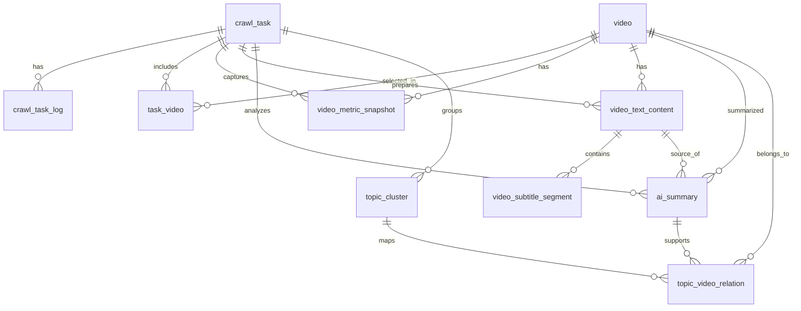

# B站关键词视频采集与分析平台 数据库设计与初始化说明

## 1. 文档目标

本文档用于说明阶段 1 的数据库设计结果、核心实体关系、字段规划、迁移方式与初始化方案。

## 2. 设计原则

- 视频基础信息与任务级分析结果分层存储
- 对可重复采集的数据保留快照能力
- 主题与 AI 分析结果可追踪、可回溯
- 保持后续任务系统、采集系统、统计系统的扩展空间

## 3. 实体关系总览



## 4. 关键设计说明

### 4.1 为什么新增 `task_video`

PRD 中列出的表已经覆盖了大部分核心对象，但在真实业务里还需要一张任务与视频的关联表。

原因：
- 同一个视频可能被不同关键词任务重复命中
- 搜索排名、关键词命中情况、综合评分都属于“任务上下文”的结果，而不是视频固有属性
- 如果直接把这些字段放在 `video` 表中，会导致不同任务之间的数据互相覆盖

因此本阶段在原计划基础上补充：
- `task_video`

## 5. 表设计

## 5.1 `crawl_task`

用途：
- 记录一次关键词采集任务及其运行配置和整体进度

关键字段：
- `id`：主键
- `keyword`：关键词
- `status`：任务状态
- `requested_video_limit`：目标采集视频数
- `max_pages`：最大分页数
- `min_sleep_seconds` / `max_sleep_seconds`：限速配置
- `enable_proxy`：是否启用代理
- `source_ip_strategy`：IP 使用策略
- `total_candidates`：候选视频数
- `processed_videos`：已处理视频数
- `analyzed_videos`：已完成 AI 分析视频数
- `clustered_topics`：主题聚类数
- `started_at` / `finished_at`
- `error_message`

## 5.2 `crawl_task_log`

用途：
- 记录任务执行过程中的关键日志

关键字段：
- `task_id`
- `level`
- `stage`
- `message`
- `payload`

## 5.3 `video`

用途：
- 存储视频的稳定基础信息

关键字段：
- `bvid`：唯一
- `aid`
- `title`
- `url`
- `author_name`
- `author_mid`
- `cover_url`
- `description`
- `tags`
- `published_at`
- `duration_seconds`

## 5.4 `task_video`

用途：
- 记录某任务命中的视频以及该任务上下文中的评分结果

关键字段：
- `task_id`
- `video_id`
- `search_rank`
- `keyword_hit_title`
- `keyword_hit_description`
- `keyword_hit_tags`
- `relevance_score`
- `heat_score`
- `composite_score`
- `is_selected`

约束：
- `task_id + video_id` 唯一

## 5.5 `video_metric_snapshot`

用途：
- 记录视频在某次任务抓取时的指标快照

关键字段：
- `task_id`
- `video_id`
- `view_count`
- `like_count`
- `coin_count`
- `favorite_count`
- `share_count`
- `reply_count`
- `danmaku_count`
- `metrics_payload`
- `captured_at`

## 5.6 `video_text_content`

用途：
- 存储清洗后的分析文本

关键字段：
- `task_id`
- `video_id`
- `has_description`
- `has_subtitle`
- `description_text`
- `subtitle_text`
- `combined_text`
- `combined_text_hash`
- `language_code`

约束：
- `task_id + video_id` 唯一

## 5.7 `video_subtitle_segment`

用途：
- 存储字幕片段明细

关键字段：
- `text_content_id`
- `segment_index`
- `start_seconds`
- `end_seconds`
- `content`

约束：
- `text_content_id + segment_index` 唯一

## 5.8 `ai_summary`

用途：
- 存储单视频 AI 摘要和主题提取结果

关键字段：
- `task_id`
- `video_id`
- `text_content_id`
- `summary`
- `topics`
- `primary_topic`
- `tone`
- `confidence`
- `model_name`
- `prompt_version`
- `raw_response`

约束：
- `task_id + video_id` 唯一

## 5.9 `topic_cluster`

用途：
- 存储任务级主题聚类结果

关键字段：
- `task_id`
- `name`
- `normalized_name`
- `description`
- `keywords`
- `video_count`
- `total_heat_score`
- `average_heat_score`
- `cluster_order`

约束：
- `task_id + normalized_name` 唯一

## 5.10 `topic_video_relation`

用途：
- 存储主题与视频的归属关系

关键字段：
- `task_id`
- `topic_cluster_id`
- `video_id`
- `ai_summary_id`
- `relevance_score`
- `is_primary`

约束：
- `task_id + topic_cluster_id + video_id` 唯一

## 5.11 `system_config`

用途：
- 存储系统默认配置与初始化参数

关键字段：
- `config_key`
- `config_name`
- `config_group`
- `config_value`
- `description`
- `is_active`

## 6. 初始化配置

首批初始化写入以下默认配置：

- `crawl.default_limits`
- `crawl.ip_strategy`
- `analysis.scoring_weights`
- `analysis.topic_clustering`
- `ai.summary_defaults`

这些配置用于：
- 默认采集上限
- 默认 IP 策略
- 相关性与热度权重
- 主题归并参数
- AI 摘要默认设置

## 7. 迁移与初始化流程

### 7.1 初始化数据库结构

```powershell
cd backend
..\ .venv\Scripts\alembic.exe upgrade head
```

说明：
- 实际执行时请连写为 `..\.venv\Scripts\alembic.exe`

### 7.2 写入默认配置

```powershell
cd backend
..\ .venv\Scripts\python.exe -m app.db.bootstrap
```

说明：
- 该脚本为幂等设计，可重复执行

### 7.3 使用统一脚本初始化

```powershell
.\scripts\init-db.ps1
```

## 8. 验收标准

- 所有核心表已创建
- 外键关系正确
- Alembic 可执行 `upgrade head`
- 默认系统配置已写入
- 可通过 SQLAlchemy 正常连接和查询
